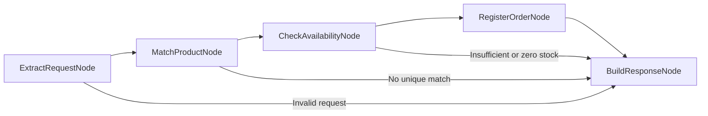

# Order fulfillment agent

A FastAPI agent that extracts one product and quantity with OCI Generative AI,
checks a JSON inventory, and calls a tool to simulate order registration.
[Specification 002](../../specs/002-order-fulfillment.md) defines its behavior.

## Workflow



Each node is a dedicated callable class in `nodes.py`. `graph.py` defines the
edges explicitly. Only extraction uses the LLM; confirmation is built from
actual registration results.

Products match exact normalized names or aliases. The bundled catalog contains
10 keyboards, 5 mice, and no monitors, with English and selected Italian aliases.
Unknown or ambiguous products request clarification. Missing or invalid
quantities and multiple products are rejected. Insufficient stock does not
produce a partial order.

The extraction prompt receives no catalog. It removes subjective modifiers
and politeness, singularizes common product names, and corrects clear typos:
`2 nice keyboards` and `2 keybordas` become `keyboard`, quantity 2.
Concrete features remain: `2 nice wireless keyboards` becomes `wireless keyboard`
and does not match a generic Keyboard entry. Unknown products are not replaced
with catalog items. Model behavior is checked separately from offline tests.

Successful registration decrements stock atomically and stores an order with a
UUID in memory. A lock prevents concurrent requests from overselling. Restarting
resets stock and orders; run **one Uvicorn worker**. Each POST is a new attempt,
so repeating a request can create another order. Persistence and idempotency
are outside this demo's scope.

## Configure and run from the repository root

```bash
conda run -n nemo-relay-on-oci python -m pip install -r requirements-dev.txt
cp -n demos/order_fulfillment/.env.example demos/order_fulfillment/.env
```

The copy command preserves an existing `.env`. Edit the local file:

| Variable | Default | Meaning |
| --- | --- | --- |
| `OCI_REGION` | Required | Region where the selected model is available |
| `MODEL_ID` | Required | OCI model ID; replace the template placeholder |
| `OCI_COMPARTMENT_ID` | Required | Compartment OCID for inference |
| `OCI_AUTH_TYPE` | `API_KEY` | `API_KEY` or `RESOURCE_PRINCIPAL` |
| `OCI_CONFIG_FILE` | `~/.oci/config` | Local SDK configuration; API_KEY only |
| `OCI_CONFIG_PROFILE` | `DEFAULT` | Local SDK profile; API_KEY only |
| `OCI_STRUCTURED_OUTPUT_METHOD` | `function_calling` | Model-supported method: `function_calling`, `json_schema`, or `json_mode` |
| `OCI_REASONING_EFFORT` | Empty; omitted | Optional model-dependent reasoning setting: `NONE`, `MINIMAL`, `LOW`, `MEDIUM`, `HIGH`; lowercase values are normalized |
| `OTEL_EXPORTER_OTLP_TRACES_ENDPOINT` | Empty; export disabled | Collector HTTP/protobuf trace URL, such as `http://localhost:4318/v1/traces` |
| `OTEL_SERVICE_NAME` | `order-fulfillment` | Trace service identity |

The endpoint is derived as
`https://inference.generativeai.<OCI_REGION>.oci.oraclecloud.com` for OCI's
commercial realm. Existing process variables override the agent's `.env`.
The file is resolved beside the agent module, independently of the working
directory. No values are copied into the process environment.

For API_KEY, the local OCI configuration references your signing key.
For RESOURCE_PRINCIPAL, omit local profile/path settings: the OCI runtime
supplies credentials. Both modes require permission to invoke the model in
the selected compartment. Private keys and `.env` stay outside Git.

With `nemo-relay-on-oci` already active in your shell, start the server from
the repository root:

```bash
./demos/order_fulfillment/start.sh
```

The script uses the active environment's Python. It does not activate Conda.
Stop the server with Ctrl+C.

Open [API documentation](http://127.0.0.1:8000/docs) or send:

```bash
curl http://127.0.0.1:8000/health
curl -X POST http://127.0.0.1:8000/orders \
  -H 'Content-Type: application/json' \
  -d '{"request":"I would like 2 keyboards"}'
```

Example successful response (order ID varies):

```json
{
  "status": "confirmed",
  "request": "I would like 2 keyboards",
  "message": "Order <uuid> registered successfully in the simulated system.",
  "product": "Keyboard",
  "quantity": 2,
  "order_id": "<uuid>",
  "available": 8
}
```

HTTP 200 includes business outcomes `confirmed`, `invalid_request`, `no_match`,
`out_of_stock`, and `insufficient_stock`. Invalid HTTP input returns 422.
OCI service/network failures return 502 without provider details; unexpected
internal failures return 500. `/health` checks local readiness, not inference.
Model extraction quality and structured-output support depend on the selected
OCI model; offline tests cannot verify those capabilities.

### Troubleshooting a 502 response

In function-calling mode, startup installs a process-wide filter for the exact
`GenericProvider could not extract text and returned an empty string...`
UserWarning attributed to `langchain_oci.chat_models.oci_generative_ai`.
Tool-call-only responses can validly contain no text. Other messages,
categories, and modules remain visible, and extraction validation still runs.
The filter is not installed in JSON output modes. Restart the server to apply
changes to the output mode or warning configuration.

Read the JSON `detail` response as well as the server log. OCI rejections log
the upstream status and error code; transport failures log the exception type.
Raw provider messages, prompts, and credentials are not logged by this handler.

If the model rejects function tools with active reasoning, set
`OCI_REASONING_EFFORT=NONE` in this agent's `.env` and restart the server.
This resolved the OCI 400 rejection observed with the configured model; it is
not a universal requirement for all models. Leave the setting empty for models
that do not accept it. OCI's SDK expects uppercase reasoning enum values.
See the [OCI request reference](https://docs.oracle.com/en-us/iaas/tools/python/latest/api/generative_ai_inference/models/oci.generative_ai_inference.models.GenericChatRequest.html).

## NeMo Relay behavior

The LangGraph callback observes graph execution. Explicit typed Relay scopes
wrap `extract_order_llm` and `register_order`, because the installed graph
callback covers chains rather than provider calls. These scopes show the
model/tool boundaries; they do not provide token accounting or full native
OCI request/response telemetry.

Set `OTEL_EXPORTER_OTLP_TRACES_ENDPOINT` to enable native HTTP/protobuf export.
The application owns the Relay activation from startup through shutdown,
when it closes the exporter. The collector is a separate service and must
accept OTLP traces; no collector is started by this demo. Graph callbacks may
include input and output content in trace data, so use synthetic demo orders.
Use only the documented trace endpoint variable for this demo; avoid overlapping
process-wide OTLP exporters or header settings.

## Verification

Run from the root in the required Conda environment:

```bash
conda run -n nemo-relay-on-oci python -m black demos tests
conda run -n nemo-relay-on-oci python -m black --check demos tests
conda run -n nemo-relay-on-oci python -m pylint --persistent=no demos tests
conda run -n nemo-relay-on-oci python -m pytest
conda run -n nemo-relay-on-oci python -m pip check
```

Tests cover graph branches, HTTP validation, structured parsing, stock races,
configuration, both authentication wiring paths, and actual Relay scope events.
Cloud calls are substituted; exporter configuration and cleanup are verified
without a running collector. The coverage threshold includes all `demos/` code.

Local configuration startup and `/health` have been checked. A live OCI request
for two keyboards returned HTTP 200 and `confirmed` after setting reasoning
effort to `NONE` for the configured model. This validates that sample and model,
not extraction accuracy across all inputs. External collector delivery remains
unverified: inspect the collector/backend for graph, extraction, and registration
scopes when running a sample order.

Return to the [demo index](../../README.md#demos).
