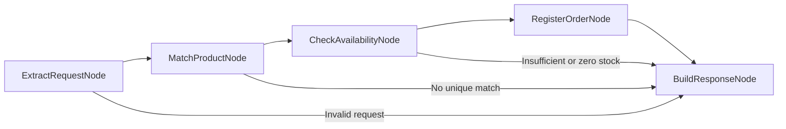

# Order fulfillment agent

A FastAPI agent that extracts one product and quantity with OCI Generative AI,
checks a JSON inventory, and calls a tool to simulate order registration.
[Specification 002](../../specs/002-order-fulfillment.md) defines its behavior.

## Workflow



Each node is a dedicated callable class in `nodes.py`. `graph.py` defines the
edges explicitly. Only extraction uses the LLM; confirmation is built from
actual registration results.

Products match exact normalized names or aliases. The bundled catalog contains
10 keyboards, 5 mice, and no monitors, with English and selected Italian aliases.
Unknown or ambiguous products request clarification. Missing or invalid
quantities and multiple products are rejected. Insufficient stock does not
produce a partial order.

The extraction prompt receives no catalog. It removes subjective modifiers
and politeness, singularizes common product names, and corrects clear typos:
`2 nice keyboards` and `2 keybordas` become `keyboard`, quantity 2.
Concrete features remain: `2 nice wireless keyboards` becomes `wireless keyboard`
and does not match a generic Keyboard entry. Unknown products are not replaced
with catalog items. Model behavior is checked separately from offline tests.

Successful registration decrements stock atomically and stores an order with a
UUID in memory. A lock prevents concurrent requests from overselling. Restarting
resets stock and orders; run **one Uvicorn worker**. Each POST is a new attempt,
so repeating a request can create another order. Persistence and idempotency
are outside this demo's scope.

## Configure and run from the repository root

```bash
conda run -n nemo-relay-on-oci python -m pip install -r requirements-dev.txt
cp -n demos/order_fulfillment/.env.example demos/order_fulfillment/.env
```

The copy command preserves an existing `.env`. Edit the local file:

| Variable | Default | Meaning |
| --- | --- | --- |
| `OCI_REGION` | Required | Region where the selected model is available |
| `MODEL_ID` | Required | OCI model ID; replace the template placeholder |
| `OCI_COMPARTMENT_ID` | Required | Compartment OCID for inference |
| `OCI_AUTH_TYPE` | `API_KEY` | `API_KEY` or `RESOURCE_PRINCIPAL` |
| `OCI_CONFIG_FILE` | `~/.oci/config` | Local SDK configuration; API_KEY only |
| `OCI_CONFIG_PROFILE` | `DEFAULT` | Local SDK profile; API_KEY only |
| `OCI_STRUCTURED_OUTPUT_METHOD` | `function_calling` | Model-supported method: `function_calling`, `json_schema`, or `json_mode` |
| `OCI_REASONING_EFFORT` | Empty; omitted | Optional model-dependent reasoning setting: `NONE`, `MINIMAL`, `LOW`, `MEDIUM`, `HIGH`; lowercase values are normalized |
| `LANGFUSE_BASE_URL` | Empty | Remote instance base URL, e.g. `https://langfuse.example.com` |
| `LANGFUSE_PUBLIC_KEY` | Empty | Public API key of the Langfuse project |
| `LANGFUSE_SECRET_KEY` | Empty | Secret API key of the same project |
| `LANGFUSE_INGESTION_VERSION` | Empty | Set `4` for Langfuse v4 real-time ingestion; otherwise omit |
| `OTEL_EXPORTER_OTLP_TRACES_ENDPOINT` | Empty | Optional generic OTLP backend; must stay empty with Langfuse |
| `OTEL_SERVICE_NAME` | `order-fulfillment` | Trace service identity |
| `MODEL_PRICING_FILE` | `demos/order_fulfillment/pricing.example.json` | Relay JSON model-pricing catalog for estimated LLM cost |
| `PII_REDACTION` | `mask` | Phone-number telemetry policy: `mask`, `redact`, or `off` |

The endpoint is derived as
`https://inference.generativeai.<OCI_REGION>.oci.oraclecloud.com` for OCI's
commercial realm. Existing process variables override the agent's `.env`.
The file is resolved beside the agent module, independently of the working
directory. No values are copied into the process environment.

For API_KEY, the local OCI configuration references your signing key.
For RESOURCE_PRINCIPAL, omit local profile/path settings: the OCI runtime
supplies credentials. Both modes require permission to invoke the model in
the selected compartment. Private keys and `.env` stay outside Git.

With `nemo-relay-on-oci` already active in your shell, start the server from
the repository root:

```bash
./demos/order_fulfillment/start.sh
```

The script uses the active environment's Python. It does not activate Conda.
Stop the server with Ctrl+C.

Open [API documentation](http://127.0.0.1:8000/docs) or send:

```bash
curl http://127.0.0.1:8000/health
curl http://127.0.0.1:8000/ready
curl -X POST http://127.0.0.1:8000/orders \
  -H 'Content-Type: application/json' \
  -d '{"request":"I would like 2 keyboards"}'
```

Example successful response (order ID varies):

```json
{
  "status": "confirmed",
  "request": "I would like 2 keyboards",
  "message": "Order <uuid> registered successfully in the simulated system.",
  "product": "Keyboard",
  "quantity": 2,
  "order_id": "<uuid>",
  "available": 8
}
```

HTTP 200 includes business outcomes `confirmed`, `invalid_request`, `no_match`,
`out_of_stock`, and `insufficient_stock`. Invalid HTTP input returns 422.
OCI service/network failures return 502 without provider details; unexpected
internal failures return 500. `/health` checks local readiness, not inference.
`/ready` returns `{"status":"ready"}` once application startup has initialized
the graph.
Model extraction quality and structured-output support depend on the selected
OCI model; offline tests cannot verify those capabilities.

## OCI Enterprise AI container

[`Dockerfile`](Dockerfile) and [`agent.yaml`](agent.yaml) follow the
`linux/amd64` OCI Enterprise AI container and schema-v1 manifest conventions
used by the parallel `codex-4-oci-enterprise-ai-deployment` repository. The
root repository is the Docker build context so the image can install the pinned
runtime dependencies and import the full `demos` package. `.env` files are
excluded from the context and are never copied into the image.

Build from the repository root with Docker buildx:

```bash
docker buildx build --platform linux/amd64 --load --provenance=false --sbom=false \
  -f demos/order_fulfillment/Dockerfile -t order-fulfillment:0.1.0 .
```

The image listens on `0.0.0.0:8080`, runs as a non-root user, and supports a
read-only root filesystem with writable `/tmp`. It requires OCI resource
principal support plus `OCI_REGION`, `MODEL_ID`, and `OCI_COMPARTMENT_ID` at
runtime. The manifest resolves those non-secret values from the deployment
operator environment and fixes `OCI_AUTH_TYPE=RESOURCE_PRINCIPAL`; it contains
no credentials, OCIDs, or Langfuse keys.

The manifest declares no `/orders` functional verification because that call
requires live OCI inference. OCI platforms can use the mandatory `GET /health`
and `GET /ready` probes. Building, pushing to OCIR, and creating a hosted
application or deployment are intentionally outside this demo change.

### Troubleshooting a 502 response

In function-calling mode, startup installs a process-wide filter for the exact
`GenericProvider could not extract text and returned an empty string...`
UserWarning attributed to `langchain_oci.chat_models.oci_generative_ai`.
Tool-call-only responses can validly contain no text. Other messages,
categories, and modules remain visible, and extraction validation still runs.
The filter is not installed in JSON output modes. Restart the server to apply
changes to the output mode or warning configuration.

Read the JSON `detail` response as well as the server log. OCI rejections log
the upstream status and error code; transport failures log the exception type.
Raw provider messages, prompts, and credentials are not logged by this handler.

If the model rejects function tools with active reasoning, set
`OCI_REASONING_EFFORT=NONE` in this agent's `.env` and restart the server.
This resolved the OCI 400 rejection observed with the configured model; it is
not a universal requirement for all models. Leave the setting empty for models
that do not accept it. OCI's SDK expects uppercase reasoning enum values.
See the [OCI request reference](https://docs.oracle.com/en-us/iaas/tools/python/latest/api/generative_ai_inference/models/oci.generative_ai_inference.models.GenericChatRequest.html).

## NeMo Relay behavior

Each `POST /orders` creates one `order_fulfillment` agent root scope. Its child
spans use domain names rather than LangGraph implementation names:
`extract_order`, `match_catalog_product`, `check_inventory_availability`,
`register_order`, and `build_order_response`. Thus Langfuse renders one
readable hierarchy per order without parser, runnable, or router noise. Relay
retains the complete LLM prompt/message history and extraction output, plus the
root request/response and tool arguments/result. When `PII_REDACTION` is
enabled, detected phone numbers in those telemetry payloads are sanitized
before they reach Langfuse. Use synthetic orders and never submit secrets or
sensitive customer data: phone redaction does not protect other PII.

### PII redaction

`PII_REDACTION=mask` is the default. It sanitizes detected phone numbers in
Relay events exported to Langfuse while leaving the request sent to OCI and the
HTTP response sent to the client unchanged. `mask` retains the final four
digits; `redact` replaces detected phone numbers with `[REDACTED]`; `off`
retains unmodified telemetry payloads.

For example, with `PII_REDACTION=mask`, submit:

```bash
curl -X POST http://127.0.0.1:8000/orders \
  -H 'Content-Type: application/json' \
  -d '{"request":"I would like 2 keyboards, call me at +39 333 123 4567"}'
```

The OCI model and the HTTP response receive the original phone number. In
Langfuse, the `order_fulfillment` trace, `extract_order` generation, and
`build_order_response` span show the masked form `+** *** *** 4567` instead.
Offline verification with NeMo Relay 0.9.2 also recognized and sanitized
`+393331234567`, `333-123-4567`, and `(333) 123 4567`.

Only the Relay built-in `phone` detector is configured. Email addresses,
payment-card numbers, and any other data that the phone detector does not
recognize remain visible in telemetry. Continue using synthetic data and never
submit secrets or sensitive customer data.

### Connect directly to remote Langfuse

Edit the agent's `.env` with the URL and project API keys:

```dotenv
LANGFUSE_BASE_URL=https://your-langfuse.example.com
LANGFUSE_PUBLIC_KEY=pk-lf-your-project-key
LANGFUSE_SECRET_KEY=sk-lf-your-project-key
LANGFUSE_INGESTION_VERSION=4
OTEL_EXPORTER_OTLP_TRACES_ENDPOINT=
OTEL_SERVICE_NAME=order-fulfillment
MODEL_PRICING_FILE=demos/order_fulfillment/pricing.example.json
PII_REDACTION=mask
```

Use only the instance base URL, without `/api/public/otel` or `/v1/traces`.
The application appends `/api/public/otel/v1/traces` and creates Basic auth from
`public_key:secret_key`. Langfuse Cloud v4 requires
`LANGFUSE_INGESTION_VERSION=4` for real-time direct OTLP ingestion. Leave it
empty only for an older OTLP-capable self-hosted deployment. See
[Langfuse OTLP ingestion](https://langfuse.com/integrations/native/opentelemetry).
The endpoint also requests a JSON acknowledgement, preventing the pinned Relay
HTTP/protobuf exporter from treating Langfuse's successful JSON response as a
batch-export failure.

No collector or additional SDK is needed. Restart `./demos/order_fulfillment/start.sh`
after editing configuration, submit an order, and look for its trace in the
Langfuse project associated with those keys. Export is batched, so ingestion
is not instantaneous. Empty URL and keys disable Langfuse; partial configuration
or simultaneous generic OTLP configuration fails startup explicitly.

The app owns the Relay activation and closes it at shutdown to drain exports.
Keys are masked in settings representations and never logged by the app.
Trace payloads include prompt/message history, requests, responses, tool
arguments, and tool results. The configured PII policy sanitizes recognized
phone numbers only; use synthetic orders for all other sensitive data. Avoid process-global `OTEL_EXPORTER_OTLP_HEADERS` and
`OTEL_EXPORTER_OTLP_TRACES_HEADERS`; authentication is supplied on this endpoint.

### LLM token usage and estimated cost

The extraction generation exports OCI input, output, and total token counts
when the provider response supplies usage metadata. The default
[`pricing.example.json`](pricing.example.json) uses [OpenAI's published
GPT-5.6 Sol rates](https://developers.openai.com/api/docs/models/gpt-5.6-sol)
as a starting estimate: USD 4.00 input, USD 0.40
cached input, USD 20.00 output, and USD 5.00 cache write per million tokens.
The model is called through OCI, so these are not OCI invoice rates. Before
using the estimate for financial reporting, copy the catalogue to an untracked
local file, point `MODEL_PRICING_FILE` to it, and replace the rates with the
applicable OCI billing values. Update `pricing_as_of` and `pricing_source` at
the same time.

The catalog file is validated at startup. A missing or invalid catalog prevents
the server from starting. With real credentials and a configured catalog, send
a synthetic order and inspect the `extract_order` generation in Langfuse for
token usage and estimated cost. The export aliases Relay's USD cost attribute
to Langfuse's `gen_ai.usage.cost` field. This repository verifies the token,
pricing, and attribute projection offline; it does not claim that Langfuse
displays a real OCI cost until a real catalog has been exercised. As an
alternative to `MODEL_PRICING_FILE`, configure the model price in Langfuse
Models so Langfuse can calculate cost from the exported tokens.

## Verification

Run from the root in the required Conda environment:

```bash
conda run -n nemo-relay-on-oci python -m black demos tests
conda run -n nemo-relay-on-oci python -m black --check demos tests
conda run -n nemo-relay-on-oci python -m pylint --persistent=no demos tests
conda run -n nemo-relay-on-oci python -m pytest
conda run -n nemo-relay-on-oci python -m pip check
```

Tests cover graph branches, HTTP validation, structured parsing, stock races,
configuration, both authentication wiring paths, and actual Relay scope events.
Cloud calls are substituted; exporter configuration and cleanup are verified
without a running collector. The coverage threshold includes all `demos/` code.

Local configuration startup and `/health` have been checked. A live OCI request
for two keyboards returned HTTP 200 and `confirmed` after setting reasoning
effort to `NONE` for the configured model. This validates that sample and model,
not extraction accuracy across all inputs. Remote Langfuse delivery has been
verified with configured project credentials using a synthetic order trace with
nested graph, LLM, and registration-tool scopes.

Return to the [demo index](../../README.md#demos).
