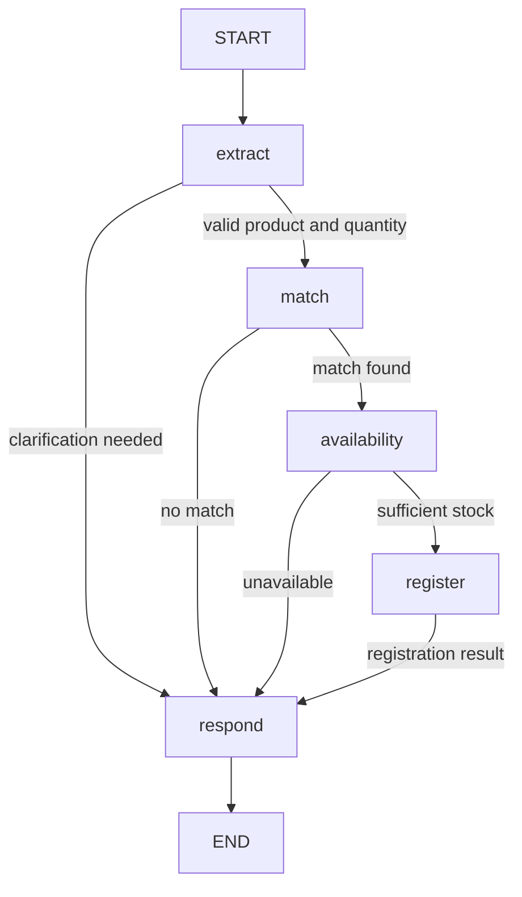

# Specification 002: Order fulfillment HTTP agent

Status: Draft — implementation details must be discussed before coding.

## Objective

Build a simple order fulfillment agent that receives a natural-language
request, extracts a product and quantity using an LLM, checks a simulated
product catalog, and registers an order through a tool when stock permits.

## Confirmed requirements

- Every agent has a dedicated folder under `demos/`.
- Every agent can be started from the repository root.
- This demo uses LangGraph with explicit nodes, transitions, and execution
  order. Each node is implemented as its own dedicated Python class.
- An LLM extracts the product name and requested quantity from the user's
  natural-language input.
- The product catalog and available quantities are simulated in a JSON file,
  loaded when the agent starts.
- The agent determines whether the requested product matches the catalog.
- If there is no match, the response states that no product was matched and
  asks the user to submit a clearer request.
- If a product matches but available quantity is zero, the response states
  that it is unavailable.
- If a product matches and sufficient stock is available, the agent calls a
  tool that simulates registering the order.
- A successful response includes the original request and a complete
  confirmation that the order was registered.
- The agent is exposed through an HTTP API using FastAPI, started by Uvicorn.
- The project stack remains OCI Generative AI, `langchain_oci`, LangGraph,
  and NeMo Relay, with traces sent through an OpenTelemetry Collector.
- All documentation is in English. All Python work uses the Conda environment
  `nemo-relay-on-oci` and follows the quality gates in `AGENTS.md`.

## Proposed graph

The following decomposition is proposed for review. Node names and class
names are provisional; each node will have a single responsibility.

| Node | Proposed class | Responsibility |
| --- | --- | --- |
| Extract | `ExtractRequestNode` | Use the LLM to extract product and quantity and validate the result |
| Match | `MatchProductNode` | Find a catalog match for the extracted product |
| Availability | `CheckAvailabilityNode` | Compare requested quantity with available stock |
| Register | `RegisterOrderNode` | Invoke the simulated order-registration tool |
| Respond | `BuildResponseNode` | Produce a business response from the graph outcome |



The extraction and registration failure paths must never produce a successful
order confirmation. The exact handling of invalid extraction, insufficient
stock, and registration failures is to be agreed before implementation.

## Proposed data contracts

These are logical fields, not final API or storage schemas.

- Input: original natural-language request.
- Extraction result: product name and requested quantity.
- Catalog entry: product identifier, product name, available quantity;
  optional aliases depend on the matching strategy.
- Graph state: original request, extracted fields, matched product,
  availability result, registration result, and final response.
- Order confirmation: original request, canonical product, ordered quantity,
  order identifier, and explicit registration confirmation.

The catalog is loaded at startup. Its exact file layout and validation rules
will be defined with the implementation design.

## Proposed HTTP interface and startup

- Demo folder: `demos/order_fulfillment/`.
- A POST endpoint accepts a natural-language request and returns the outcome.
- Proposed route: `POST /orders` with `{"request": "I would like 2 keyboards"}`.
- FastAPI provides interactive API documentation.
- The README will provide a Uvicorn command runnable from the repository root.

Final route names, response schema, HTTP status codes, health endpoint,
and Uvicorn module path remain implementation decisions.

## Observability

The intended trace path is:

```text
LangGraph nodes, LLM calls, and registration tool
    -> NeMo Relay -> OTLP -> OpenTelemetry Collector
```

Trace configuration will follow the pinned Relay version described in
[specification 001](001-dependencies-and-observability.md). Collector endpoint,
service naming, payload capture, and shutdown behavior will be specified
before implementation. Credentials must not be stored in the repository.

## Decisions to discuss before implementation

1. **OCI model and access:** model ID, region/endpoint, authentication method,
   and configuration mechanism.
2. **Product matching:** exact names and aliases, fuzzy matching, or LLM-assisted
   matching; treatment of multiple plausible matches.
3. **Quantity validation:** missing, zero, negative, fractional, or ambiguous
   quantities, and requests containing more than one product. Proposed default:
   ask for clarification unless there is one product and a positive integer.
4. **Insufficient stock:** stock is positive but below the requested quantity.
   Proposed default: reject without partial fulfillment and state availability.
5. **Simulation semantics:** whether successful orders decrement stock; whether
   orders remain in memory or are written to a local file; behavior on restart.
6. **Repeated and concurrent requests:** whether to support idempotency and how
   to prevent overselling if inventory changes.
7. **Response language and format:** language of user-facing messages and the
   fields that constitute a complete confirmation.
8. **Operational errors:** model failure, malformed catalog, and tool failure
   responses, including the corresponding HTTP status codes.
9. **Trace destination:** collector address, protocol, and which request or
   response details should appear in traces.

## Acceptance criteria

The implementation must include tests derived from the following criteria:

- A valid request for a matching product with sufficient stock follows
  extraction, matching, availability, registration, and confirmation in order.
- The product and quantity used downstream come from the validated LLM result.
- An unmatched product requests clarification and never calls registration.
- A matching product with zero stock returns unavailability and never calls
  registration.
- Registration is performed through a tool, and confirmation contains the
  original request, product, quantity, and successful registration result.
- Catalog data is read at startup, rather than reloaded for every request.
- Every graph node has a dedicated Python class.
- The API can be started from the repository root using Uvicorn.
- Offline tests substitute the LLM and external services and do not require
  OCI credentials, paid inference, or an external collector.
- Additional tests cover the edge cases agreed in the decisions above.
- Black formatting and Pylint pass with no unresolved findings; pytest passes
  with at least 80% application coverage, including all application modules.
- Documentation and changelog are updated with execution and verification
  instructions. Live OCI and collector checks are reported separately from
  offline tests.

## Current scope

This change defines the specification only. It does not implement the graph,
HTTP API, tool, catalog, or tracing configuration, and does not install new
HTTP dependencies. Implementation starts after the open details are discussed.
